# Form Flow AI | The Ultimate AI Form Filler & Automation Agent
<div align="center">
  

  <h3>🚀 Intelligent AI Form Filler & Voice-Driven Automation Agent</h3>

  <p>
    <a href="https://www.python.org/"></a>
    <a href="https://react.dev/"></a>
    <a href="https://fastapi.tiangolo.com/"></a>
    <a href="https://playwright.dev/"></a>
    <a href="https://aistudio.google.com/"></a>
    <br/>
    <a href="#-project-roadmap--execution-log"></a>
    <a href="LICENSE"></a>
  </p>
</div>

---

## 📋 Executive Summary

**Form Flow AI** is the world's most advanced **AI Form Filler** and **Automated Form Filling** agent, designed to autonomous navigate, understand, and complete complex web forms through natural voice conversation. Unlike basic autofill extensions, this **AI Form Filler** acts as an intelligent digital proxy—orchestrating a symphony of **Web Speech API** for real-time input, **Generic LLMs** (Gemini/GPT) for semantic reasoning, and **Playwright** for robust browser automation.

> **Key Value Proposition**:  
> "Don't just fill forms—delegate them." Form Flow AI turns tedious data entry into a 30-second conversation. It is the best **AI Form Filler** for handling edge cases, dynamic routing, validation rules, and even PDF overlay with human-like precision.

---

## 🎯 Current State Analysis

| Aspect | Status | Maturity | Details |
|:---|:---:|:---:|:---|
| **Backend Core** | ✅ | **Production** | Robust FastAPI architecture with scalable service factories. |
| **Frontend UI** | ✅ | **Polished** | Glassmorphism React SPA with real-time voice feedback. |
| **PDF Engine** | ✅ | **Advanced** | **NEW:** Layout-aware parsing, field detection, and text fitting. |
| **Voice I/O** | ⚠️ | **Beta** | Web Speech API (moving to Deepgram/ElevenLabs streaming). |
| **AI Agent** | ✅ | **Advanced** | LangChain-powered memory, context-aware RAG suggestions. |
| **Platform** | ⚠️ | **Web Only** | Transitioning to Chrome Extension (Manifest V3). |

### Gap Analysis
1.  **Voice Intelligence**: Upgrading from browser-native speech to **Deepgram/ElevenLabs** for sub-800ms conversational latency.
2.  **Platform Reach**: Migrating core logic to a **Browser Extension** for seamless "overlay" usage on any site.

---

## 🏗️ Technical Architecture

### 🔌 Backend Infrastructure (`form-flow-backend/`)
Built on **FastAPI**, leveraging asynchronous patterns for high-concurrency automation.

#### 1. Form Processing Engine (`services/form/`)
-   **Factory Pattern**: Dynamically routes URLs to specialized extractors (`GoogleForms`, `Typeform`, `StandardHTML`).
-   **Shadow DOM Piercing**: Recursively traverses open shadow roots to find hidden fields.
-   **Semantic Mapping**: Uses LLMs to infer field intent (e.g., mapping "How long have you lived here?" to `years_at_address`).

#### 2. Enterprise PDF Service (`services/pdf/`) **[NEW]**
-   **Visual Layout Analysis**: Algorithms to detect visual boundaries and align text perfectly.
-   **Smart Text Fitting**: Dynamic font scaling (8pt-14pt) to ensure content fits within physical box constraints.
-   **Form Overlay**: Generates pristine, flattened PDFs ready for official submission.

#### 3. Automation Service (`services/browser/`)
Powered by **Playwright** with a persistent context strategy.
-   **Humanizer**: Implements specialized typing delays (50-150ms) and cursor jitter to evade bot detection.
-   **Resilience**: Smart waiting for SPAs (Angular/React) and dynamic content loading.

#### 4. Intelligence Layer (`services/ai/`)
-   **RAG Architecture**: Retrieves user context from structured profile history.
-   **State Management**: Atomic `FormDataManager` prevents race conditions during multi-turn edits.
-   **Suggestion Engine**: Predicts email formats, addresses, and phone codes based on partial inputs.

### 💻 Frontend Architecture (`form-flow-frontend/`)
Modern **React 18** application with **Vite** and **TailwindCSS**.
-   **Glassmorphism UI**: Custom design system (`GlassCard`, `GlassInput`) for a premium aesthetic.
-   **Voice Context**: Global state management for microphone handling and audio visualization.
-   **Real-time WebSocket**: Bi-directional event stream for form updates and agent thought process display.

### 🏛️ System Architecture


## 🧩 Service Design

### AI Service
Orchestrates conversation and state management using Gemini and RAG.


### Form Service
Handles form schema extraction and automated submission via Playwright.


### PDF Service
Intelligent PDF form parsing and writing with layout analysis.


### 🪄 How Magic Fill Works

```mermaid
sequenceDiagram
    participant User
    participant Frontend as VoiceFormFiller
    participant Backend as /magic-fill
    participant LangChain as SmartFormFillerChain
    participant Gemini as Gemini LLM

    User->>Frontend: Opens Voice Interface
    Frontend->>Backend: POST /magic-fill {form_schema, user_profile}
    Backend->>LangChain: fill(user_profile, form_schema)
    LangChain->>Gemini: "Map this profile to these fields..."
    Gemini-->>LangChain: {filled_fields: [...], unfilled_fields: [...]}
    LangChain-->>Backend: MagicFillResult
    Backend-->>Frontend: {success: true, filled: {...}, summary: "..."}
    Frontend->>Frontend: Pre-populate fields, skip to first unfilled
    Frontend-->>User: "✨ 5 of 8 fields filled. Let's get the rest!"
```



---

## ✨ Comprehensive Feature Status

| Module | Feature | Status | Technical Detail |
|:---|:---|:---:|:---|
| **Parsing** | Generic HTML | ✅ Stable | `input`, `textarea`, `select`, `radio`, `checkbox` |
| | Google Forms | ✅ Stable | Custom parsing for non-standard class names |
| | Shadow DOM | ✅ Stable | Recursive traversal of shadow roots |
| | **PDF Forms** | ✅ Stable | **NEW:** Layout analysis & text overlay |
| **Voice** | Speech-to-Text | ✅ Stable | Web Speech API with silence detection |
| | Text-to-Speech | ✅ Stable | Browser-native synthesis |
| | Wake Word | ⏳ Planned | "Hey Wizard" activation |
| **Automation** | Auto-Fill | ✅ Stable | Human-mimicry typing; DOM injection fallback |
| | Checkbox Logic | ✅ Stable | Smart toggle + efficient iteration |
| | CAPTCHA Solving | ✅ Stable | Multi-strategy: Stealth, Auto-wait, 2Captcha API, Manual fallback |
| **UI/UX** | Glassmorphism | ✅ Stable | Full system-wide theme |
| | Visualization | ✅ Live | Recharts + Gemini Insights (Tabbed Dashboard) |

---

## 🔐 CAPTCHA Solving Architecture

Form Flow AI uses a **multi-strategy approach** to handle CAPTCHAs:


**Supported CAPTCHA Types:**
- ✅ Google reCAPTCHA v2/v3
- ✅ hCaptcha
- ✅ Cloudflare Turnstile
- ✅ Generic image CAPTCHAs (via 2Captcha)

---

## 🗺️ Project Roadmap & Execution Log

### ✅ Completed Phases

#### **Phase 9: Enterprise PDF Engine** *(Dec 29-30)*
*Focus: Intelligent document parsing and layout-aware overlay.*
- **PDF Intelligence**: `PdfParser` with visual layout analysis to detect fields by coordinates.
- **Smart Writer**: `PdfWriter` with "Text Fitting" dynamic typography (8pt-14pt scaling).
- **Production Ready**: Robust overlay generating flattened, submission-ready PDFs.

#### **Phase 8: Enhanced State Management & Suggestion Engine** *(Dec 28)*
*Focus: Industry-grade conversation state architecture with contextual intelligence.*
- **State Management**: Atomic `FormDataManager` preventing race conditions during edits.
- **Contextual Signals**: Email/Phone/Address inference from partial inputs.
- **RAG Prompts**: 5-step protocol (LOAD → ANALYZE → UNDERSTAND → REASON → UPDATE) for precise filling.
- **Test Coverage**: 111 tests passing ✅

#### **Phase 6-7: Conversational Intelligence** *(Dec 24-26)*
*Focus: Production-ready agent with adaptive personality.*
- **Adaptive Responses**: `STYLE_VARIATIONS` matrix (Concise/Formal/Helpful).
- **Sentiment Gating**: Weighted scoring to detect frustration and escalate help.
- **Multi-Modal Fallback**: Type/Skip/Retry logic for robust error handling.

---

### 🔮 Upcoming Phases

#### **Phase 10: Browser Extension Architecture** *(Coming Soon)*
*Goal: Deploy as Chrome/Edge extension for inline form assistance.*

| Component | Status | Description |
|:---|:---:|:---|
| **Manifest V3** | 🚧 | Background Service Worker setup |
| **Content Script** | 🚧 | DOM Injection & Overlay UI |
| **Bridge** | ⏳ | WebSocket communication with local backend |

**Deliverables:**
- [ ] Deepgram WebSocket integration for <500ms latency.
- [ ] Chrome Web Store submission.

---

## 📊 Success Metrics

| Metric | Target | Current Status |
|:---|:---|:---:|
| **Latency** | Voice input → Response < 1s | ~1.2s |
| **Accuracy** | Form completion success > 95% | 92% |
| **Efficiency** | Time reduction vs manual | 65% |
| **Reliability** | Test Coverage | 88% |

---

## 🔧 Tech Stack Evolution

| Component | Beta Configuration | Production Target |
|:---|:---|:---|
| **STT** | Web Speech API | **Deepgram Nova-2** (WebSocket) |
| **TTS** | Browser SpeechSynthesis | **ElevenLabs Turbo v2** (Streaming) |
| **LLM** | Gemini Pro (REST) | **Gemini Pro Vision** (Agentic) |
| **Automation** | Playwright (Server) | **Playwright** + Chrome Extension |

---

## 🚨 Risk Mitigation

| Risk | Strategy |
|:---|:---|
| **API Costs** | Aggressive caching + Local LLM fallback (Phi-2/Mistral) |
| **Bot Detection** | Human-like jitter + Random delays (50-150ms) |
| **Complex Forms** | Recursive Shadow DOM traversal + Dynamic wait |

---

## 🚀 Setup & Configuration

### Environment Variables (`.env`)
```ini
DATABASE_URL=sqlite:///./sql_app.db
SECRET_KEY=your_secret_key_here
GEMINI_API_KEY=your_gemini_key_here
# Optional for Production:
# DEEPGRAM_API_KEY=sk-xxx
# ELEVENLABS_API_KEY=xi-xxx
```

### Installation

**1. Backend Setup**
```bash
cd form-flow-backend
python -m venv .venv
# Windows:
.venv\Scripts\activate
# Linux/Mac:
# source .venv/bin/activate

pip install -r requirements.txt
playwright install chromium
uvicorn main:app --reload
```

**2. Frontend Setup**
```bash
cd form-flow-frontend
npm install
npm run dev
```

---

## 📁 Project Structure

```bash
Form-Flow-AI/
├── form-flow-backend/
│   ├── core/                 # Config, DB, Base Models
│   ├── routers/              # API Endpoints (FastAPI)
│   ├── services/
│   │   ├── form/             # HTML Parsing & Extraction
│   │   ├── pdf/              # Visual PDF Analysis & Overlay
│   │   ├── voice/            # STT/TTS Pipelines
│   │   ├── ai/               # LLM Agent & RAG
│   │   └── browser/          # Playwright Automation
│   └── utils/
├── form-flow-frontend/       # React + Vite + TailwindCSS
└── docker-compose.yml
```