# Form Flow AI
**Advanced Voice-Driven Form Automation & Intelligence Platform**

> **Current Status**: 🚀 **Active Development / Advanced Beta** (v0.8.0)  
> **Last Updated**: December 21, 2025

---

## 📋 Executive Summary

**Form Flow AI** is an enterprise-grade agentic assistant that revolutionizes online form interaction. By orchestrating a pipeline of **Web Speech API** for real-time input, **LLM (Gemini/GPT)** for context understanding, and **Playwright** for browser automation, it enables users to complete complex web forms entirely through natural conversation.

Unlike traditional autofill tools, Form Flow AI acts as an intelligent agent: it parses the DOM to understand field semantic relationships, validates inputs against field constraints, and handles edge cases like dynamic multi-step navigation and anti-bot measures.

---

## 🎯 Current State Analysis

| Aspect | Status | Details |
|:---|:---:|:---|
| **Backend Core** | ✅ Solid | FastAPI + Playwright automation pipeline |
| **Frontend UI** | ✅ Polished | React + Glassmorphism design system |
| **Voice I/O** | ⚠️ Beta | Web Speech API (client-side, limited) |
| **LLM Integration** | ⚠️ Basic | Direct Gemini calls (stateless) |
| **Platform** | ⚠️ Web Only | SPA, not yet a browser extension |

### Gap Analysis
1. **Voice Intelligence Gap**: Using Web Speech API instead of planned Deepgram STT + ElevenLabs TTS (streaming, professional-grade).
2. **LLM Orchestration Gap**: Need LangChain-powered conversational agent with memory.
3. **Platform Gap**: Currently a web app; target is a seamless browser extension.

---

## 🏗️ Technical Architecture

### 🔌 Backend Infrastructure (`form-flow-backend/`)
Built on **FastAPI**, leveraging asynchronous processing for non-blocking voice and automation.

#### 1. Form Processing Engine (`services/form/`)
- **Factory Pattern**: `FormParser` routes to specialized extractors:
    - `GoogleFormsExtractor`: Handles obfuscated Google Forms DOM.
    - `StandardExtractor`: Heuristic analysis for generic HTML.
    - `ShadowDomExtractor`: Traverses open shadow roots.
- **Semantic Processor**: Maps raw inputs (`<input name="q3_v">`) to labels ("Years of Experience").

#### 2. Automation Service (`services/browser/`)
Powered by **Playwright** with persistent browser context.
- **Anti-Detection**: Human-like cursor movements, random typing delays (50-150ms), user-agent rotation.
- **Resilience**: Robust `TargetClosedError` handling, dynamic wait strategies for SPAs.

#### 3. Intelligence Layer (`services/ai/`)
- **Context Injection**: Form state + user answers + transcription fed to LLM.
- **Prompt Engineering**: Structured prompts for valid JSON output, minimizing hallucinations.

### 💻 Frontend Architecture (`form-flow-frontend/`)
Modern **React 18** app with **Vite**.
- **State Management**: `VoiceProvider` context for mic/speech state.
- **Feature-Based Structure**: `features/auth`, `features/dashboard`, `features/form-wizard`.
- **Design System**: Custom Glassmorphism UI (`GlassCard`, `GlassInput`) with TailwindCSS.

### 🪄 How Magic Fill Works

```mermaid
sequenceDiagram
    participant User
    participant Frontend as VoiceFormFiller
    participant Backend as /magic-fill
    participant LangChain as SmartFormFillerChain
    participant Gemini as Gemini LLM

    User->>Frontend: Opens Voice Interface
    Frontend->>Backend: POST /magic-fill {form_schema, user_profile}
    Backend->>LangChain: fill(user_profile, form_schema)
    LangChain->>Gemini: "Map this profile to these fields..."
    Gemini-->>LangChain: {filled_fields: [...], unfilled_fields: [...]}
    LangChain-->>Backend: MagicFillResult
    Backend-->>Frontend: {success: true, filled: {...}, summary: "..."}
    Frontend->>Frontend: Pre-populate fields, skip to first unfilled
    Frontend-->>User: "✨ 5 of 8 fields filled. Let's get the rest!"
```



---

## ✨ Comprehensive Feature Status

| Module | Feature | Status | Technical Detail |
|:---|:---|:---:|:---|
| **Parsing** | Generic HTML | ✅ Stable | `input`, `textarea`, `select`, `radio`, `checkbox` |
| | Google Forms | ✅ Stable | Custom parsing for non-standard class names |
| | Shadow DOM | ✅ Stable | Recursive traversal of shadow roots |
| | Dynamic Fields | 🚧 Beta | Detection of post-interaction fields |
| **Voice** | Speech-to-Text | ✅ Stable | Web Speech API with silence detection |
| | Text-to-Speech | ✅ Stable | Browser-native synthesis |
| | Wake Word | ⏳ Planned | "Hey Wizard" activation |
| **Automation** | Auto-Fill | ✅ Stable | Human-mimicry typing; DOM injection fallback |
| | Checkbox Logic | ✅ Stable | Smart toggle + efficient iteration |
| | Captcha Solving | 🚧 WIP | Hook points for 2Captcha/AntiCaptcha |
| **UI/UX** | Glassmorphism | ✅ Stable | Full system-wide theme |
| | Visualization | 🚧 Beta | Recharts + Gemini Analysis |

---

## 🗺️ Project Roadmap & Execution Log

### ✅ Completed Phases

#### **Phase 5: Architecture Modularity & Polish** *(Present)*
*Focus: Long-term maintainability and visual distinction.*
- **Backend Reorganization**: Migrated to domain-driven packaging (`core`, `services`, `routers`).
- **Parser Factory**: Strategy Pattern classes for extensibility (Typeform, Microsoft Forms).
- **Hero Section**: "Vitruvian Man" animations, Emerald Green theme.

#### **Phase 4: Automation Hardening** *(Dec 17-19)*
*Focus: Reliability in hostile environments.*
- **Human-Like Simulation**: `HumanTyper` with probabilistic keystroke delays.
- **Complex Fields**: File Upload, Grid/Scale radio buttons.
- **Checkbox Optimization**: Correct "Terms & Conditions" handling.

#### **Phase 3: Experience Revolution** *(Dec 16)*
*Focus: Frontend UX and visual language.*
- **Glassmorphism Design System**: `GlassCard`, `LightPillar`, `ScrollStack`.
- **Landing Page V2**: Scroll-triggered animations.
- **Router Guarding**: Fixed auth flow circular dependencies.

#### **Phase 2: Intelligence & Data** *(Mid-December)*
*Focus: Enhancing assistant capabilities.*
- **Semantic Detection**: Gemini API for field label analysis.
- **External Data**: SerpAPI for real-time citations.
- **Query Optimization**: Eliminated N+1 problems.

#### **Phase 1: Foundation & Entities** *(Early December)*
*Focus: Data modeling and basic CRUD.*
- **Polymorphic Associations**: `Note`/`File` attachments to any entity.
- **File Management**: `createFiles` utility and blob storage.

---

### 🔮 Upcoming Phases

#### **Phase 6: Voice Pipeline Upgrade** *(Week 1-2)*
*Goal: Replace browser APIs with production-grade streaming.*

| Component | Current | Target |
|:---|:---|:---|
| STT | Web Speech API | Deepgram WebSocket |
| TTS | Browser SpeechSynthesis | ElevenLabs Streaming |

**Deliverables:**
- [ ] Deepgram integration with WebSocket streaming
- [ ] ElevenLabs TTS with chunked audio delivery
- [ ] End-to-end latency < 800ms
- [ ] Fallback to Web Speech if services unavailable

---

#### **Phase 7: Conversational Intelligence Layer** *(Week 3-4)*
*Goal: Transform single-shot LLM calls into stateful, multi-turn conversations.*

**LangChain Agent Architecture:**
```
Components:
├── ConversationBufferMemory (track dialogue)
├── FormFieldAnalyzer Tool (extract values + confidence)
├── Prompt Template (helpful assistant role-play)
└── ReAct Agent (ask clarifying questions)
```

**Multi-Question Batching:**
```
❌ BAD (Robotic):
"Please provide your name." [waits]
"Please provide your email." [waits]

✅ GOOD (Conversational):
"Hey! What's your full name, email, and phone? 
 You can rattle them off—I'm listening!"
```

**Deliverables:**
- [ ] LangChain agent with ConversationBufferMemory
- [ ] Semantic field clustering for intelligent batching
- [ ] Clarification question generation
- [ ] Confidence scoring (confirm on low scores)

---

#### **Phase 8: Browser Extension Architecture** *(Week 5-6)*
*Goal: Deploy as Chrome/Edge extension for inline form assistance.*

**Manifest V3 Structure:**
```
extension/
├── manifest.json
├── background.js      # BackendBridge (WebSocket to FastAPI)
├── content.js         # FormDetector + VoiceOverlay
├── popup.html/js      # Mini control panel
└── overlay.css        # Shadow DOM styles
```

**Architecture Flow:**
```
User clicks "🎤 Fill with Voice" on webpage
    ↓
Content Script extracts form schema
    ↓
Background Worker → FastAPI backend
    ↓
WebSocket: Page ↔ Extension ↔ Backend
    ↓
User speaks → Deepgram → LLM → ElevenLabs → User hears
    ↓
Content Script fills fields in real-time
```

**Deliverables:**
- [ ] Manifest V3 extension scaffold
- [ ] Content script with form detection + overlay UI
- [ ] Background worker with WebSocket bridge
- [ ] Popup interface for controls
- [ ] Chrome Web Store listing

---

#### **Phase 9: Production Hardening** *(Week 7-8)*
*Goal: Bulletproof for real-world usage.*

**Security & Privacy:**
- Rate limiting (`slowapi`: 10 requests/minute)
- AES-256 audio stream encryption
- GDPR compliance (data retention, delete account)

**Error Recovery:**
- `tenacity` retry with exponential backoff
- Fallback chain: Deepgram → Whisper API
- Circuit breakers for external APIs

**Observability:**
- `structlog` structured logging
- Telemetry dashboard (success rates, latency)

**Deliverables:**
- [ ] Rate limiting on all endpoints
- [ ] Circuit breakers for external APIs
- [ ] Comprehensive error messages
- [ ] Telemetry dashboard

---

#### **Phase 10: Launch & Iteration** *(Week 9-10)*
*Goal: Get users, collect feedback, iterate.*

**Beta Testing Program:**
- Recruit 50 users (students, elderly, accessibility advocates)
- A/B test: Single-question vs multi-question batching

**Marketing Assets:**
- Landing page with extension download CTA
- Demo video: Manual form vs voice-assisted
- Blog: "How We Built a Voice-First Form Assistant"

---

## 📊 Success Metrics

| Metric | Target |
|:---|:---|
| **Latency** | Voice input → Response < 1 second |
| **Accuracy** | Form completion success > 95% |
| **Efficiency** | 60% time reduction vs manual |
| **Accessibility** | WCAG 2.1 AA compliance |
| **Adoption** | 1,000 extension installs (Month 1) |

---

## 🔧 Tech Stack Evolution

| Component | Beta (Current) | Production (Target) |
|:---|:---|:---|
| **STT** | Web Speech API | Deepgram WebSocket |
| **TTS** | Browser SpeechSynthesis | ElevenLabs Streaming |
| **LLM** | Direct Gemini API | LangChain Agent (GPT-4/Gemini) |
| **Automation** | Playwright (server) | Playwright + Content Script |
| **Frontend** | React SPA | React + Chrome Extension |
| **State** | React Context | LangChain Memory + Redis |

---

## 🚨 Risk Mitigation

| Risk | Mitigation |
|:---|:---|
| API costs (Deepgram/ElevenLabs) | Aggressive caching, "economy mode" with Web Speech fallback |
| Extension store rejection | Pre-review with Chrome team, privacy policy compliance |
| Complex multi-step forms | Detect navigation changes, maintain session across page loads |
| Captcha blockers | Partner with 2Captcha/hCaptcha, manual fallback |

---

## 🚀 Setup & Configuration

### Environment Variables (.env)
```ini
DATABASE_URL=sqlite:///./sql_app.db
SECRET_KEY=your_secret_key_here
ALGORITHM=HS256
ACCESS_TOKEN_EXPIRE_MINUTES=30
GEMINI_API_KEY=your_gemini_key_here
# Future:
# DEEPGRAM_API_KEY=
# ELEVENLABS_API_KEY=
```

### Installation

**Backend**
```bash
cd form-flow-backend
python -m venv .venv
.venv\Scripts\activate  # Windows
pip install -r requirements.txt
playwright install chromium
uvicorn main:app --reload
```

**Frontend**
```bash
cd form-flow-frontend
npm install
npm run dev
```

---

## 📁 Project Structure

```
Form-Flow-AI/
├── form-flow-backend/
│   ├── core/                 # Config, DB, base classes
│   ├── routers/              # API endpoints
│   ├── services/
│   │   ├── form/
│   │   │   ├── detectors/    # Captcha, dynamic field detection
│   │   │   ├── extractors/   # Google Forms, Standard, Shadow DOM
│   │   │   └── processors/   # Enrichment, validation
│   │   ├── voice/            # STT/TTS pipelines
│   │   ├── ai/               # LLM integration
│   │   └── browser/          # Playwright automation
│   └── utils/
├── form-flow-frontend/
│   ├── src/
│   │   ├── features/         # auth, dashboard, form-wizard
│   │   ├── components/ui/    # Glassmorphism design system
│   │   └── services/         # API clients
│   └── public/
└── docker-compose.yml
```